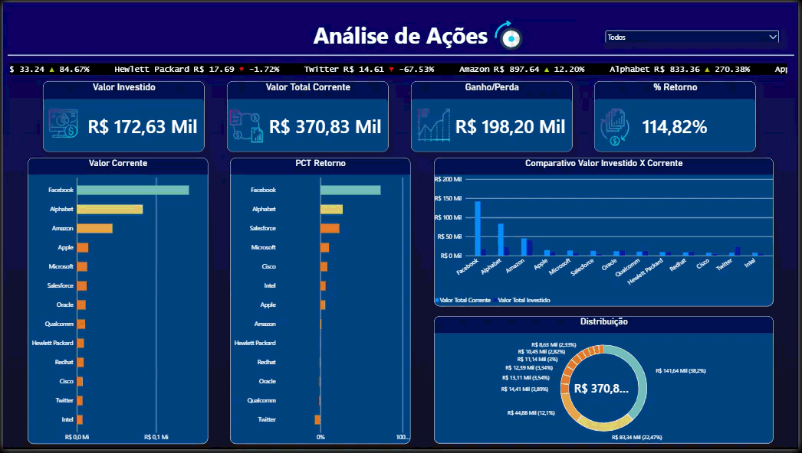

# 📊 Análise de Ações

Dashboard feito no Power BI para analisar uma carteira de ações.

### Ferramentas
- Power BI
- DAX

### O que pratiquei
- Criação de medidas com DAX
- Gráficos e indicadores
- Filtros e segmentações
- Análise de retorno e distribuição dos investimentos

### Dashboard

Projeto desenvolvido durante meus estudos de Power BI no curso Formação Microsoft Power BI Profissional da Udemy.
 
